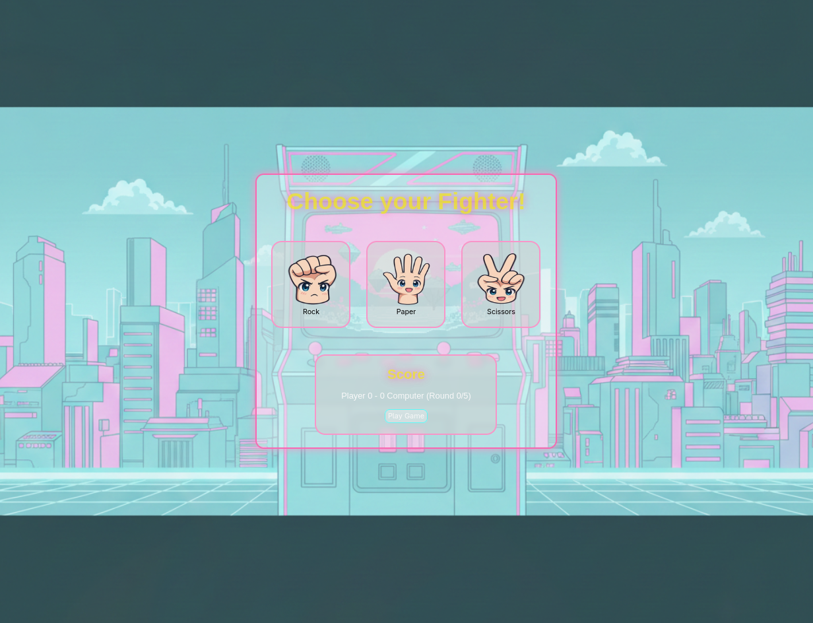

# Awesome Rock Paper Scissors 🪨📄✂️

**The Odin Project - Foundations**

Kawaii Rock Paper Scissors game with dynamic scoring!

## 🎮 Features

- 🎯 Score tracking for player and computer
- 🔢 Round counter with game progression
- 🎨 Visual feedback for wins, losses, and ties
- 📱 Fully responsive design
- 🎭 Smooth CSS animations and transitions

## 🛠️ Technologies Used

- HTML5
- CSS3 (Animations, Keyframes, Transitions)
- Vanilla JavaScript (Game Logic, DOM Manipulation)

## 💡 What I Learned

- Game state management (score, rounds, choices)
- Random computer choice generation
- Win/loss/tie logic with all combinations
- Creating anticipation with shake animations

## 🎲 Game Rules

- Rock beats Scissors
- Paper beats Rock
- Scissors beats Paper
- First to 5 points wins!

## 🚀 Live Demo

[Play the Game!](https://exc1d.github.io/odin-kawaii-rps/)

## 👨‍💻 Development Process

**Part of:** The Odin Project - Foundations Path
**Time spent:** ~X hours
**Approach:** Built game logic first, then enhanced with animations

Built with ❤️ as part of my 100-Day JavaScript Challenge!

---

**For Joy, Hero, Aiah, and Aria** 💙🐕
